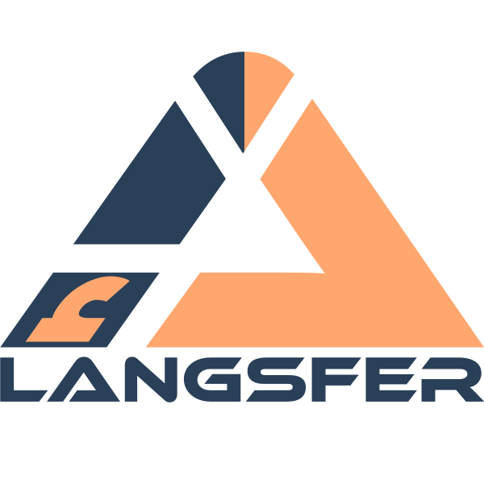

<p align="center" style="text-align:center;">
    
</p>
<p align="center" style="text-align:center;">
    A library for language transfer methods and algorithms.
</p>

Language transfer refers to a few related things:
- initializing a Large Language Model (LLM) in a new, typically low-resource, target language (e.g. German, Arabic)
  from another LLM trained in high-resource source language (e.g. English),
- extending the vocabulary of an LLM by adding new tokens and initializing their embeddings
  in a manner that allows them to be used with little to no extra training,
- specializing the vocabulary of a multilingual LLM to one of its supported languages. 

The implemented methods are:

- [WECHSEL: Effective initialization of subword embeddings for cross-lingual transfer of monolingual language models.](https://arxiv.org/abs/2112.06598) Minixhofer, Benjamin, Fabian Paischer, and Navid Rekabsaz. arXiv preprint arXiv:2112.06598 (2021).
- [CLP-Transfer: Efficient language model training through cross-lingual and progressive transfer learning.](https://arxiv.org/abs/2301.09626) Ostendorff, Malte, and Georg Rehm. arXiv preprint arXiv:2301.09626 (2023).
- [FOCUS: Effective Embedding Initialization for Specializing Pretrained Multilingual Models on a Single Language.](https://arxiv.org/abs/2305.14481) Dobler, Konstantin, and Gerard de Melo. arXiv preprint arXiv:2305.14481 (2023).

## Quick Start

### Installation

To install the latest stable version from PyPI use:

```shell
pip install langsfer
```

To install the latest development version from the repository use:

```shell
git clone git@github.com:AnesBenmerzoug/langsfer.git
cd langsfer
pip install .
```

### WECHSEL

The package provide high-level interfaces to instantiate each of the methods,
without worrying too much about the package's internals.

For example, to instantiate the WECHSEL method, you would use:

```python
from langsfer.high_level import wechsel
from langsfer.initialization import WeightedAverageEmbeddingsInitialization
from langsfer.embeddings import TransformersEmbeddings, FastTextEmbeddings
from langsfer.utils import download_file
from transformers import AutoTokenizer

source_embeddings = TransformersEmbeddings.from_model_name_or_path("roberta-base")
target_tokenizer = AutoTokenizer.from_pretrained("benjamin/roberta-base-wechsel-german")
target_auxiliary_embeddings = FastTextEmbeddings.from_model_name_or_path("en")
source_auxiliary_embeddings = FastTextEmbeddings.from_model_name_or_path("de")

bilingual_dictionary_file = download_file(
    "https://raw.githubusercontent.com/CPJKU/wechsel/main/dicts/data/swahili.txt",
    "swahili.txt",
)

embedding_initializer = wechsel(
    source_embeddings=source_embeddings,
    target_tokenizer=target_tokenizer,
    target_auxiliary_embeddings=target_auxiliary_embeddings,
    source_auxiliary_embeddings=source_auxiliary_embeddings,
    bilingual_dictionary_file=bilingual_dictionary_file,
)
```

To initialize the target embeddings you would then use:

```python
target_embeddings = embedding_initializer.initialize(seed=16, show_progress=True)
```

The result is an object of type `TransformersEmbeddings` that contain the initialized
embeddings in its `embeddings_matrix` field and the target tokenizer in its `tokenizer` field.

We can then replace the source model's embeddings matrix with this newly initialized embeddings matrix:

```python
from transformers import AutoModel

# Load the source model
source_model = AutoModel.from_pretrained("roberta-base")
source_model.copy()
# Resize its embedding layer
source_model.resize_token_embeddings(len(target_tokenizer))
# Replace the source embeddings matrix with the target embeddings matrix
source_model.get_input_embeddings().weight.data = target_embeddings.embeddings_matrix
# Save the new model
source_model.save_pretrained("path/to/target_model")
```

## Contributing

Refer to the [contributing guide](CONTRIBUTING.md) for instructions on you can make contributions to this repository.

## License

This package is license under the [LGPL-2.1](https://www.gnu.org/licenses/old-licenses/lgpl-2.1.en.html) license.
